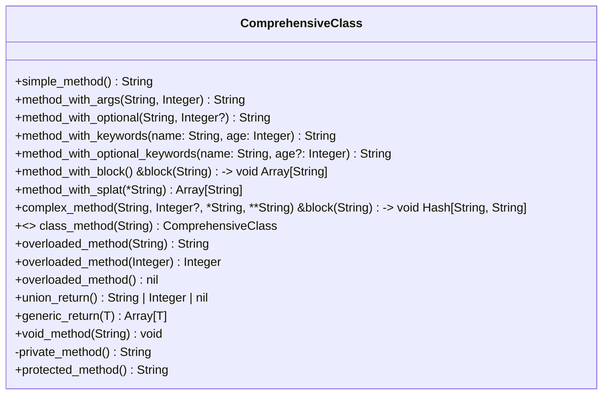

# ファイル形式

## パースするファイル
このスペックで扱うRBSファイルを扱う

```rbs
```rbs
class ComprehensiveClass
  # インスタンスメソッド - 引数なし
  def simple_method: () -> String
  
  # インスタンスメソッド - 位置引数
  def method_with_args: (String name, Integer age) -> String
  
  # インスタンスメソッド - オプション引数
  def method_with_optional: (String name, ?Integer age) -> String
  
  # インスタンスメソッド - キーワード引数
  def method_with_keywords: (name: String, age: Integer) -> String
  
  # インスタンスメソッド - オプションキーワード引数
  def method_with_optional_keywords: (name: String, ?age: Integer) -> String
  
  # インスタンスメソッド - ブロック引数
  def method_with_block: () { (String) -> void } -> Array[String]
  
  # インスタンスメソッド - 可変長引数
  def method_with_splat: (*String args) -> Array[String]
  
  # インスタンスメソッド - 複合引数
  def complex_method: (String name, ?Integer age, *String tags, **String options) { (String) -> void } -> Hash[String, String]
  
  # クラスメソッド
  def self.class_method: (String param) -> ComprehensiveClass
  
  # オーバーロードメソッド
  def overloaded_method: (String) -> String
                       | (Integer) -> Integer
                       | () -> nil
  
  # Union型戻り値
  def union_return: () -> (String | Integer | nil)
  
  # Generic型戻り値
  def generic_return: [T] (T value) -> Array[T]
  
  # void戻り値
  def void_method: (String message) -> void
  
  private
  
  # プライベートメソッド
  def private_method: () -> String
  
  protected
  
  # プロテクトメソッド
  def protected_method: () -> String
end
```
```

## 出力するファイル形式
このスペックで出力するファイル形式はMermaid.jsのクラス図形式

### Mermaid.js図の出力


### ビューワーURL出力
binスクリプト実行時に以下の形式で出力する：

```
Mermaid.js Viewer URL:
https://mermaid.live/edit

Copy and paste the following Mermaid.js code:

classDiagram
    class ComprehensiveClass {
        +simple_method() String
        +method_with_args(String, Integer) String
        +method_with_optional(String, Integer?) String
        +method_with_keywords(name: String, age: Integer) String
        +method_with_optional_keywords(name: String, age?: Integer) String
        +method_with_block() &block(String) -> void Array[String]
        +method_with_splat(*String) Array[String]
        +complex_method(String, Integer?, *String, **String) &block(String) -> void Hash[String, String]
        +<<static>> class_method(String) ComprehensiveClass
        +overloaded_method(String) String
        +overloaded_method(Integer) Integer
        +overloaded_method() nil
        +union_return() String | Integer | nil
        +generic_return(T) Array[T]
        +void_method(String) void
        -private_method() String
        +protected_method() String
    }
```