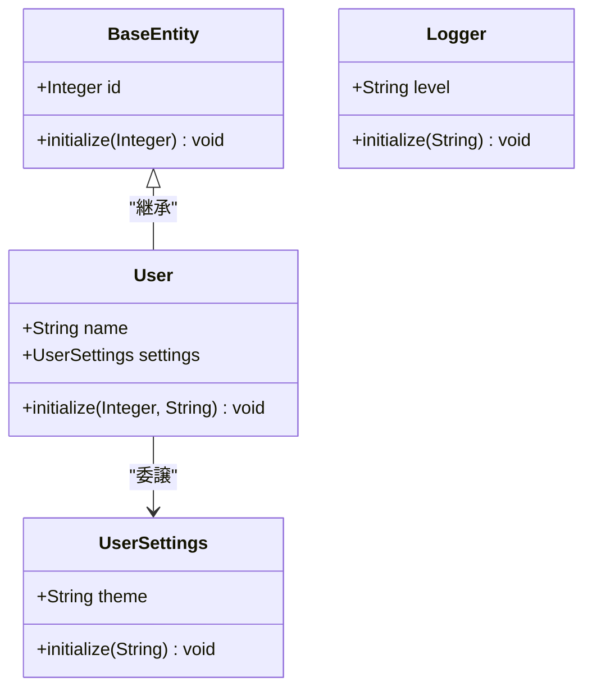

# ファイル形式

## パースするファイル
このスペックで扱う4種類のクラス関係を含む複数のRBSファイル

```rbs
# 基本となるクラス - base_entity.rbs
class BaseEntity
  attr_reader id: Integer
  
  def initialize: (id: Integer) -> void
end

# 継承クラス - user.rbs
class User < BaseEntity
  attr_reader name: String
  attr_reader settings: UserSettings
  
  def initialize: (id: Integer, name: String) -> void
end

# 委譲先のクラス - user_settings.rbs
class UserSettings
  attr_reader theme: String
  
  def initialize: (theme: String) -> void
end

# 関係しないクラス - logger.rbs
class Logger
  attr_reader level: String
  
  def initialize: (level: String) -> void
end
```

## 出力するファイル形式
このスペックで出力するファイル形式はMermaid.jsのクラス図形式（4種類のクラス関係を表現）

