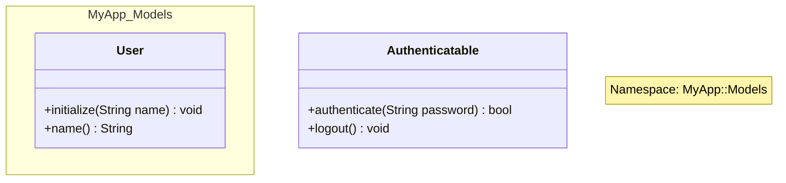

# Design Document

## Overview

既存のRBSパーサーを拡張して、moduleがネームスペースとして使用されているかどうかを判別する機能を追加します。

## Architecture

### 拡張ポイント

1. `SignatureAnalyzer`に`determine_namespace_usage`メソッドを追加
2. `ModuleNode`に`is_namespace`属性を追加  
3. `Formatter::JSON`で`is_namespace`をHashに含める

## Components and Interfaces

### 1. SignatureAnalyzer の拡張

```ruby
class << self
  private

  def determine_namespace_usage(members)
    # 他のクラスやmoduleを含む場合はネームスペース
    # メソッドのみの場合は通常のmodule
    members.any? { |member| 
      member.is_a?(RBS::AST::Declarations::Class) || 
      member.is_a?(RBS::AST::Declarations::Module) 
    }
  end
end
```

### 2. ModuleNode の拡張

```ruby
def initialize(name:, includes: [], extends: [], is_namespace: false)
  super(name: name, type: :module)
  @includes = includes
  @extends = extends
  @is_namespace = is_namespace
end
```

### 3. Formatter の拡張

**Formatter::JSON**の既存メソッドに`is_namespace`を追加：

```ruby
def convert_module_definition_to_hash(module_def)
  {
    type: module_def.type,
    name: module_def.name,
    superclass: nil,
    methods: module_def.methods.map { |method| convert_method_to_hash(method) },
    is_namespace: module_def.is_namespace,
    includes: module_def.includes,
    extends: module_def.extends
  }
end
```

**Formatter::MermaidJS**でのネームスペース表現の制約：

- Mermaid.jsでは`namespace`の入れ子ができない
- `::`記号が使えないため、`MyApp::Models`は`MyApp_Models`として表現
- 空のnamespaceはエラーになるため、空のネームスペースmoduleは`<<namespace>>`ステレオタイプ付きのclassとして表現
- 各moduleにnoteを追加してオリジナルのネームスペース構造を説明

```ruby
# ネームスペース表現の例
# MyApp::Models::User -> namespace MyApp_Models { class User }
# EmptyNamespace -> class EmptyNamespace { <<namespace>> }
```

## Test Fixtures

### spec/fixtures/target_namespace.rbs

```rbs
# ネームスペースとして使用されるmodule
module MyApp
  module Models
    class User
      def initialize: (String name) -> void
      def name: () -> String
    end
  end
end

# 通常のmodule（メソッドのみ）
module Authenticatable
  def authenticate: (String password) -> bool
  def logout: () -> void
end

# 空のmodule（ネームスペースとして判定）
module EmptyNamespace
end
```

### spec/fixtures/compare_namespace.json

```json
{
  "structure": [
    {
      "type": "module",
      "name": "MyApp",
      "superclass": null,
      "methods": [],
      "is_namespace": true,
      "includes": [],
      "extends": []
    },
    {
      "type": "module", 
      "name": "Authenticatable",
      "superclass": null,
      "methods": [
        {
          "name": "authenticate",
          "method_type": "instance",
          "visibility": "public",
          "parameters": [
            {
              "name": "password",
              "type": "String"
            }
          ],
          "return_type": "bool",
          "overloads": []
        },
        {
          "name": "logout",
          "method_type": "instance", 
          "visibility": "public",
          "parameters": [],
          "return_type": "void",
          "overloads": []
        }
      ],
      "is_namespace": false,
      "includes": [],
      "extends": []
    },
    {
      "type": "module",
      "name": "EmptyNamespace",
      "superclass": null,
      "methods": [],
      "is_namespace": true,
      "includes": [],
      "extends": []
    }
  ]
}
```

### spec/fixtures/compare_namespace.mermaid



## Testing Strategy

既存の`spec/integration_spec.rb`を拡張して、ネームスペース判定機能をテストします。