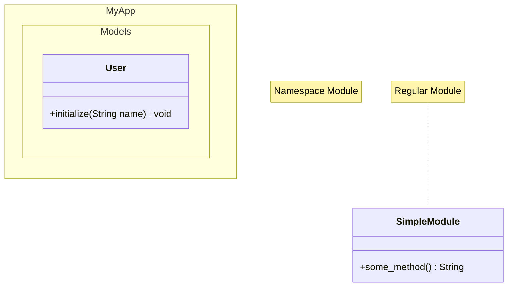

# ファイル形式

## パースするファイル
このスペックで扱うRBSファイルを扱う

### ネームスペースとして使用されるmodule
```rbs
module MyApp
  module Models
    class User
      def initialize: (String name) -> void
    end
  end
end
```

### 単純なmodule（ネームスペースではない）
```rbs
module SimpleModule
  def some_method: () -> String
end
```

## 出力するファイル形式
このスペックで出力するファイル形式
JSONとMermaid.jsでmoduleがネームスペースかどうかを判別した構造情報

### JSON出力
```json
{
  "file_path": "spec/fixtures/target_modules.rbs",
  "structure": [
    {
      "type": "module",
      "name": "MyApp",
      "is_namespace": true,
      "methods": [],
      "nested_definitions": [
        {
          "type": "module", 
          "name": "Models",
          "is_namespace": true,
          "methods": [],
          "nested_definitions": [
            {
              "type": "class",
              "name": "User"
            }
          ]
        }
      ]
    },
    {
      "type": "module",
      "name": "SimpleModule", 
      "is_namespace": false,
      "methods": [
        {
          "name": "some_method",
          "visibility": "public",
          "parameters": [],
          "return_type": "String"
        }
      ],
      "nested_definitions": []
    }
  ]
}
```

### Mermaid.js出力
