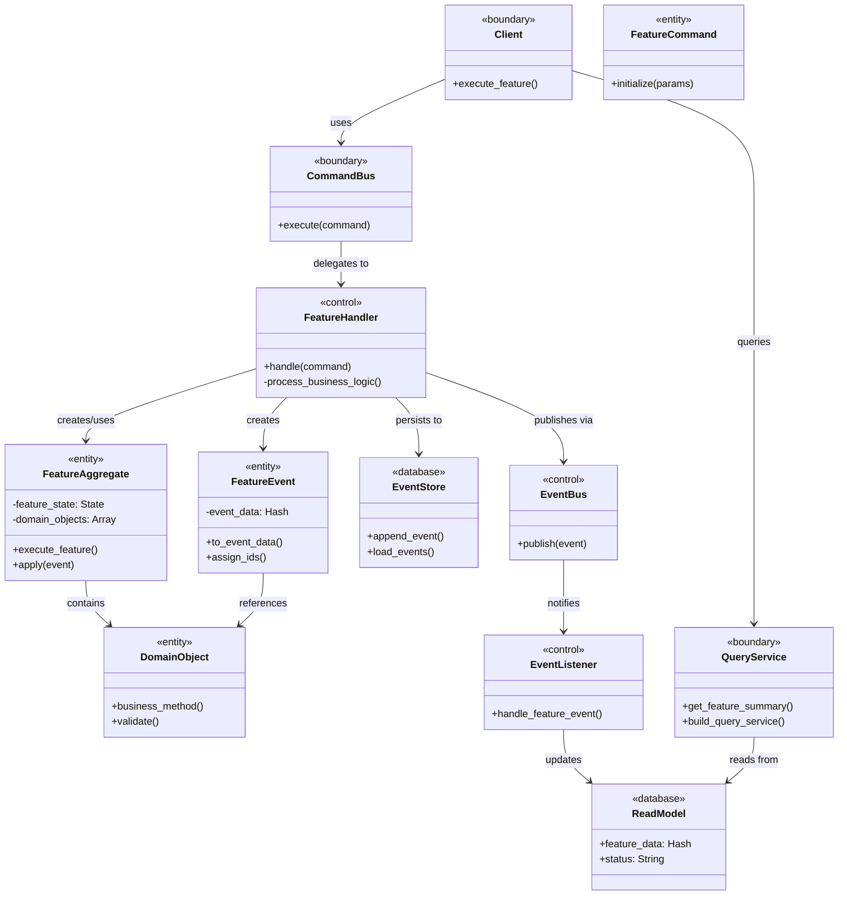

# Spec作成方法

## 概要

このドキュメントは、プロジェクトにおける機能仕様書作成の標準ワークフローとファイル構造を定義します。

## ファイル構造

各機能仕様は以下のディレクトリ構造に従う必要があります：

```
.kiro/specs/{カテゴリ}/{機能名}/
├── usecase_description.md  # ユースケース記述（要件定義）
├── domain_design.md        # 機能固有のドメイン設計
├── codebase_design.md      # コードベース設計（クラス構造・RBS型定義）
├── data_design.md          # データ設計（DB物理設計・イベント設計）
└── usecase_spec.rb         # ユースケーステスト仕様
```

## ワークフローステップ

### 1. ユースケース記述フェーズ
- **ファイル**: `usecase_description.md`
- **目的**: ユースケース形式で機能要件を定義する
- **内容**:
  - ユースケース概要（名前、アクター、目的）
  - 基本フロー（前提条件と主要成功シナリオ）
  - 代替フロー
  - 事後条件（成功時・失敗時）
  - 非機能要件

#### 完了基準
- [ ] ユースケース概要（名前、アクター、目的）が記述されている
- [ ] 基本フローの主要成功シナリオが明確に定義されている
- [ ] 事後条件（成功時・失敗時）が具体的に記述されている

### 2. ドメイン設計フェーズ
- **ファイル**: `domain_design.md`
- **目的**: 機能固有のドメイン要素を定義する
- **内容**:
  - 機能固有のドメイン概念（共通ドメインモデルにない新しい要素のみ）
  - 機能固有のビジネスルール
  - 機能固有のドメインサービス
  - 機能固有のドメインイベント
- **注意**: 主要ドメインオブジェクトにあるものをできるだけ有効活用して共通のドメインモデリングを拡張する

#### 完了基準
- [ ] 機能固有のドメイン概念が1つ以上定義されている
- [ ] 機能固有のビジネスルールが明記されている
- [ ] 共通ドメインモデルとの重複がない
- [ ] 機能固有のドメインサービスが定義されている
- [ ] 機能固有のドメインイベントが定義されている
- [ ] 他機能との境界が明確になっている

### 3. コードベース設計フェーズ
- **ファイル**: `codebase_design.md`
- **目的**: クラス構造とアーキテクチャの詳細設計を作成する
- **内容**:
  - ロバストネス風のクラス関連図を含むアーキテクチャ概要
  - コンポーネントの責務
  - 主要メソッドのRBS型定義
  - インターフェース仕様
  - エラーハンドリング戦略
  - テスト戦略

#### クラス関連図の作成指針
ロバストネス風のクラス関連図では、以下のステレオタイプを使用してクラスを分類する：

- **<<boundary>>**: UI/インターフェース層（Client, CommandBus, QueryServiceなど）
- **<<control>>**: アプリケーション層（Handler, EventBus, EventListenerなど）
- **<<entity>>**: ドメイン層（Command, Aggregate, Event, ドメインオブジェクトなど）
- **<<database>>**: データストア層（EventStore, ReadModelsなど）

#### クラス関連図のサンプル



### 完了基準
- [ ] ロバストネス風クラス関連図が作成されている
- [ ] 主要クラスの責務が定義されている
- [ ] 基本的なRBS型定義が記述されている
- [ ] インターフェース仕様が明確に定義されている
- [ ] エラーハンドリング戦略が記述されている


### 4. データ設計フェーズ
- **ファイル**: `data_design.md`
- **目的**: データベース物理設計とイベント設計を作成する
- **内容**:
  - データベーススキーマ設計（書き込み側・読み込み側）
  - イベントデータ構造設計
  - データ移行戦略
  - パフォーマンス考慮事項
  - データ整合性制約

#### 完了基準
[ ] 書き込み側のスキーマ設計が完了している
[ ] 読み込み側のスキーマ設計が完了している
[ ] イベントデータ構造が定義されている
[ ] データ整合性制約が定義されている
[ ] パフォーマンス考慮事項が記述されている
[ ] インデックス戦略が定義されている


### 5. ユースケーステストフェーズ
- **ファイル**: `usecase_spec.rb`
- **目的**: 包括的なテスト仕様を作成する
- **内容**:
  - 冒頭にコメントとしてユースケース記述
  - ユースケースフローに従ったテスト構造
  - 基本フローテスト（主要成功シナリオ）
  - 代替フローテスト
  - 事後条件の検証
  - RSpecの構造（subject、describe、context、it）
  - 実装前でも書ける要素の明確化

#### 実装前でも確定できる要素
設計フェーズ完了時点で以下の要素は確定できる：

**RSpecの基本構造**:
```ruby
# 冒頭にユースケース記述をコメントで記載
# ユースケース: [機能名]
# アクター: [利用者]
# 目的: [目的の説明]
# 基本フロー: [ステップ1-N]

describe "[機能名]ユースケース" do
  subject { [エントリーポイントのメソッド呼び出し] }
  
  context "[正常系のコンテキスト]" do
    xit "[期待される結果の説明]"
    xit "[状態変化の説明]"
  end
  
  context "[代替フローのコンテキスト]" do
    xit "[代替ケースの説明]"
  end
  
  context "[エラーケースのコンテキスト]" do
    xit "[エラー処理の説明]"
  end
end
```

**確定できる具体的要素**:
- **subject**: 設計で定義されたエントリーポイント（CommandBus.execute、QueryServiceのメソッドなど）
- **describe**: 機能名とユースケース名
- **context**: 基本フロー、代替フロー、エラーケースの分類
- **it（xit）**: 事後条件と期待される結果の説明文
- **テストケース名**: 設計で定義された振る舞いと状態変化

### 完了定義
- [ ] ユースケース記述がコメントで含まれている
- [ ] ユースケース記述に沿ったテストケースが設計されている
- [ ] RSpecファイルとして実装可能な構造になっている

## レビュープロセス
1. **ユースケースレビュー**: 要件の完全性を確認
2. **ドメイン設計レビュー**: ドメイン要素の妥当性を検証
3. **コードベース設計レビュー**: アーキテクチャと型定義を検証
4. **データ設計レビュー**: データ構造と制約を検証
5. **ユースケーステストレビュー**: テストケース設計を承認


## 補足
### タスクリストフェーズは存在しない
  - 実装の順序は開発者の判断と好みによって変わる
  - 具体的なファイル構造は既に設計文書で定義済み
  - テストケースの実装順序は事前に決める必要がない
  - 設計が完了していれば、何を実装すべきかは自明
- tasks.md自体も作成しない


