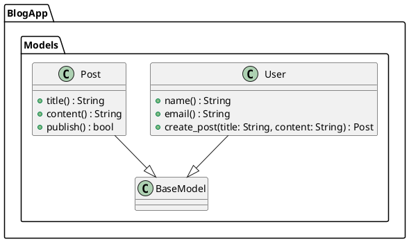

# RBS to Diagram

RubyのRBS（Ruby Signature）ファイルを解析して、Mermaid.jsやPlantUMLの図を自動生成するCLIツールです。RBSで定義された型情報、クラス構造、モジュール関係を視覚的な図として出力することで、Rubyプロジェクトの設計理解とドキュメント作成を支援します。

## 📚 このプロジェクトの目的

RBSファイルから**自動的に図を生成**することで、Rubyプロジェクトの設計を視覚化し、チーム内での設計理解とコミュニケーションを促進することを目指します。

## 🏗️ 設計思想

- **RBSファーストアプローチ**: 型定義（RBS）を設計書として活用し、実装と設計の同期を重視
- **複数フォーマット対応**: Mermaid.js、PlantUML、JSONの3つの出力形式をサポート
- **シンプルなCLI**: 直感的で使いやすいコマンドライン操作
- **責務分離**: Parser（解析）とFormatter（出力）の明確な分離

## 現在の開発ステータス
自分自身で試す(ドックフィーディング)をする前の開発状態です
ドックフィーディングをして問題がなかったら、リリースをしていく予定です

## 🚀 クイックスタート

### インストール

```bash
git clone https://github.com/your-username/rbs_to_diagram.git
cd rbs_to_diagram
bundle install
```

### 基本的な使用方法

```bash
# デモを実行（サンプルRBSファイルを使用）
./bin/rbs_to_diagram --demo

# 単一ファイルを変換
./bin/rbs_to_diagram input.rbs output.mermaid

# ディレクトリ内の全RBSファイルを変換
./bin/rbs_to_diagram source/ output.plantuml

# 引数なしで実行（sourceディレクトリを自動処理）
./bin/rbs_to_diagram
```

### 出力フォーマット

拡張子によって自動的に出力形式が決まります：

- `.mermaid` → Mermaid.js形式
- `.plantuml` → PlantUML形式  
- `.json` → JSON形式（デフォルト）

## 💡 使用例

### 入力例（RBSファイル）

```ruby
# domain_models.rbs
module BlogApp
  module Models
    class User < BaseModel
      attr_reader name: String
      attr_reader email: String
      def create_post: (title: String, content: String) -> Post
    end

    class Post < BaseModel
      attr_reader title: String
      attr_reader content: String
      def publish: () -> bool
    end
  end
end
```

### 出力例（PlantUML）



## 🔧 主要機能

### 1. RBSファイル解析
- クラス、モジュール、メソッド定義の抽出
- 継承関係、インクルード・エクステンド関係の識別
- 型情報とメソッドシグネチャの解析

### 2. 複数フォーマット出力
- **Mermaid.js**: Webブラウザで表示可能なクラス図
- **PlantUML**: 高品質な図を生成する業界標準ツール
- **JSON**: プログラムで処理しやすい構造化データ

### 3. 柔軟な入力オプション
- 単一ファイル処理
- ディレクトリ一括処理
- デモモード（サンプルファイル使用）

## 📁 プロジェクト構造

```
lib/
├── rbs_parser/          # RBS解析エンジン
│   └── signature_analyzer/
├── formatter/           # 出力フォーマッター
│   ├── diagram/         # 図形式（Mermaid.js, PlantUML）
│   └── json/           # JSON形式
├── result/             # 解析結果データ構造
└── rbs_to_diagram.rb   # メインエントリーポイント
```

### 主要クラス

- **RBSToDiagram**: アプリケーションのエントリーポイント
- **RBSParser**: RBSファイルの解析処理を統括
- **Formatter**: 解析結果の出力形式変換を統括
- **Result**: RBS解析結果を集約するデータクラス

## 🧪 テスト

```bash
# 全テストを実行
bundle exec rspec

# 統合テストのみ実行
bundle exec rspec spec/integration_spec.rb
```

## 📊 対応するRBS構文

- クラス定義（継承含む）
- モジュール定義（インクルード・エクステンド含む）
- メソッド定義（オーバーロード含む）
- 属性定義（attr_reader, attr_writer, attr_accessor）
- 型パラメータ
- ネストしたクラス・モジュール

## 📄 ライセンス

このプロジェクトはMITライセンスの下で公開されています。

## 🔗 関連リンク

- [RBS公式ドキュメント](https://github.com/ruby/rbs)
- [Mermaid.js](https://mermaid-js.github.io/mermaid/)
- [PlantUML](https://plantuml.com/)
